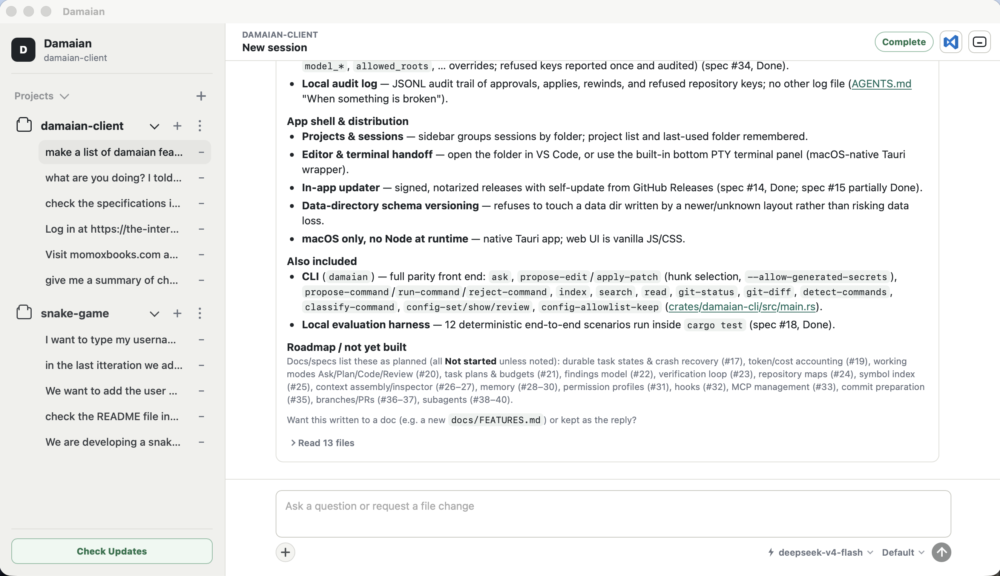

# Damaian

A local-first AI coding assistant for macOS. Damaian works on a Git repository
on your machine: it answers questions about your code, previews every edit as a
diff before touching a file, and keeps file access, command execution, and your
API keys under your control.

> **Developer preview.** Damaian is usable for everyday local workflows and can
> update itself from GitHub Releases, but it is not yet Developer ID signed or
> notarized. macOS may ask you to confirm the first launch — see
> [macOS Installation](docs/MACOS_INSTALLATION.md).

## What you can do

- **Chat with your codebase.** Ask questions and get streamed answers, with the
  repository files used for each answer shown as clickable links.
- **Review edits before they land.** File-change requests come back as a diff
  preview. Apply or reject changes per file — or per individual hunk — and
  Damaian checks file hashes so it never overwrites work you changed after the
  preview.
- **Stay in control of the terminal.** When the assistant needs a local fact, it
  can run read-only commands (like `git status` or `git log`) on its own;
  anything else waits for your approval in the conversation.
- **Organize work by project.** A Projects sidebar groups chat sessions by
  folder, and your project list and last-used folder are remembered between
  launches.
- **Hand off to your editor.** Open the current folder in Visual Studio Code, or
  use the built-in bottom terminal panel, in one click.
- **Keep secrets safe.** Detected credentials are redacted from context, command
  output, and diffs, and your model API key is stored in the macOS Keychain.
- **Update in place.** When a newer signed release is available, an update button
  appears in the app.

## Requirements

- macOS 14 (Sonoma) or newer
- Git installed and on your `PATH`
- An API key for an OpenAI-compatible model provider (e.g. OpenAI, or a local
  provider such as Ollama)

No Node.js runtime is required to run the packaged app.

## Install

1. Download the latest `Damaian_<version>_aarch64.dmg` from the GitHub Releases
   page (Apple Silicon).
2. Open the DMG and drag `Damaian.app` into `Applications`.
3. Launch it. On first run, follow [macOS Installation](docs/MACOS_INSTALLATION.md)
   if macOS blocks the unsigned developer-preview build.

## Quick start

1. Open Damaian and select `+` beside **Projects** to pick a local Git
   repository.
2. Open **Settings**, add your model provider details, and use the
   **Model API Key** controls to store your key in the Keychain.
3. Go to the **Chat** tab and ask a question about the repository, or request a
   change such as “add a test for the config parser” and review the diff preview.

The [Damaian User Guide](docs/USER_GUIDE.md) walks through each of these in
detail.

## Documentation

- [User Guide](docs/USER_GUIDE.md) — day-to-day usage, settings, model providers
- [macOS Installation](docs/MACOS_INSTALLATION.md) — install and first-launch steps
- [Troubleshooting](docs/TROUBLESHOOTING.md) — config and log locations, diagnosing failures
- [Security Policy](SECURITY.md) — safety model and vulnerability reporting
- [Development](docs/DEVELOPMENT.md) — building from source, the CLI, and releases
- [AGENTS.md](AGENTS.md) — conventions and constraints for coding agents

## License

See [LICENSE](LICENSE).
